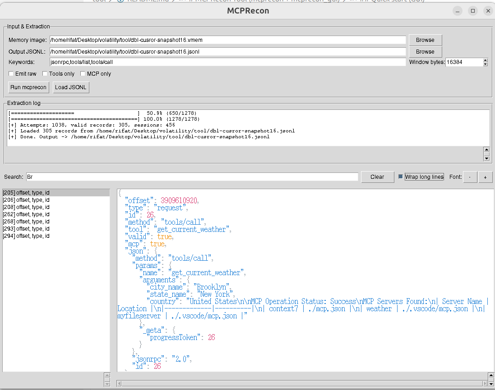

# MCPRecon Tool (mcprecon + mcprecon_gui)

Self-contained tooling to carve MCP/JSON-RPC traffic from raw memory images and explore the results.

## Contents
- `mcprecon.py` – CLI carver that scans a memory image and emits newline-delimited JSON (`.jsonl`).
- `mcprecon_gui.py` – Tkinter GUI that can run `mcprecon.py` and browse the resulting JSONL.
- Sample artifacts (`*.vmem`) for testing; `sample.vmem` is a symlink to an included snapshot for quick trials.
- Optional sample snapshot download (Google Drive) for quick runs.
- `tool_screenshot.png` – example GUI output.

## Requirements
- Python 3.9+.
- Tkinter (for the GUI). On Debian/Ubuntu: `sudo apt-get install python3-tk`; macOS typically bundles it; Windows installers usually include it.
- No pip packages required; the code uses only the Python standard library.
- Optional: Volatility3 if you want automatic `linux.pslist` (`--vol3` flag).

## Quick start (GUI)
```bash
cd tool
python3 mcprecon_gui.py
```
In the GUI:
1) Click **Browse** under “Memory image” and pick your snapshot (e.g., `*.vmem`).
2) The output JSONL path auto-fills; change if desired.
3) Adjust options (keywords, window bytes, emit raw, tools-only, MCP-only).
4) Click **Run mcprecon**. Progress shows in the log pane; when finished the JSONL loads automatically. Use the left list to select records and the search box to filter.

You can also start the GUI with an existing JSONL:
```bash
python3 mcprecon_gui.py path/to/existing.jsonl
```

Example with the bundled snapshot:
```bash
cd tool
python3 mcprecon_gui.py  # choose sample.vmem as the memory image, output e.g. sample.jsonl
# later, reopen:
python3 mcprecon_gui.py sample.jsonl
```
Sample snapshot download (Google Drive):
`https://drive.google.com/file/d/16d84BfG19auxwERKwajmNnDD0gVYo2Q9/view?usp=sharing`

GUI example output: `tool_screenshot.png`


## Quick start (CLI)
```bash
cd tool
python3 mcprecon.py snapshot.vmem --window 16384 --keywords jsonrpc tools/list tools/call --emit-raw > out.jsonl
```
Example (large window, MCP-only) mirroring the command used during development:
```bash
cd tool
python3 mcprecon.py snapshot.vmem --keywords jsonrpc tools/list tools/call --mcp-only --window 68415249 > sample_snapshot.jsonl
```
Example with the bundled snapshot:
```bash
cd tool
python3 mcprecon.py sample.vmem --emit-raw > sample.jsonl
python3 mcprecon_gui.py sample.jsonl
```
Common flags:
- `--tools-only` keep only `tools/call` requests + matched responses.
- `--mcp-only` keep only MCP-semantic messages (and their pairs).
- `--regions-file <file>` restrict carving to offset ranges (JSON/JSONL/TSV).
- `--client {codex,cursor,copilot,auto,other}` tag regions; enables pslist matching.
- `--ps-file <pslist>` provide a process list (text/JSON/JSONL/vol3 JSON).
- `--vma-file <vmas>` VMA ranges (pid,start,end[,tag]) used when `--client` set.
- `--vol3 <path/to/vol.py>` auto-run `linux.pslist` (requires Volatility3).
- `--emit-raw` include raw JSON text in output.

Output format (one JSON object per line):
```json
{
  "offset": 123456,
  "session": 0,
  "type": "request|response|notification|unknown",
  "id": 42,
  "method": "tools/call",
  "tool": "example_tool",
  "confidence": 0.87,
  "mcp": true,
  "json": { ... },
  "raw": "{...}"  // only when --emit-raw
}
```

## Tips
- Increase `--window` if anchors are detected but JSON cannot be balanced (defaults to 16 KB).
- Use `--keywords` to add custom anchors; `jsonrpc` is always included automatically.
- Large images can take time; watch the progress bar in stderr or the GUI log.
- Keep output on fast storage; writing JSONL to HDD/USB will slow scans.

## Tested environment
- Python 3.10 on Linux with Tkinter.
- No non-stdlib dependencies installed.

## Troubleshooting
- “No module named _tkinter”: install Tkinter (`python3-tk` on Debian/Ubuntu).
- GUI not loading output: check log pane for mcprecon errors; verify paths are readable/writable.
- If Volatility3 options fail, run mcprecon without `--vol3` or provide `--ps-file`/`--vma-file` manually.
